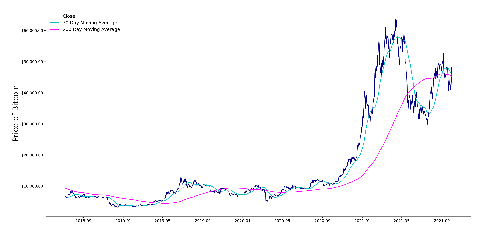
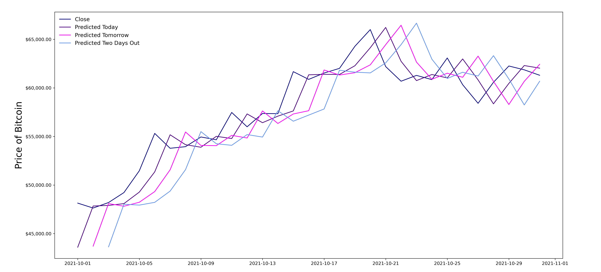

# Cryptocurrency Time Series
Authors: [TJ Bray](https://www.linkedin.com/in/thomas-tj-bray-24499354/), [Aalok Joshi](https://www.linkedin.com/in/aalokjoshi113/), [Paul Lindquist](https://www.linkedin.com/in/paul-lindquist/)

## Overview
Time series is, quite simply, a series of data points indexed over time. Time series analysis is used to extract meaningful statistics, patterns, etc. from time series data, while time series forecasting uses a model to predict future values based on previously observed data. We encounter time series in our everyday lives in the form of outside temperatures, home values and stock prices, all over time.

Stock price forecasting has generally limited success, as factors like purchase volume and current events can cause price fluctuations. Can the same be said of cryptocurrency, namely the heavily traded Bitcoin? In this project, we use traditional time series analysis and forecasting to predict Bitcoin prices.

We choose Bitcoin for 2 reasons:
- Greatest gross price of all cryptocurrencies
- Trading popularity (volume)

## Business Objective
This project postulates that we are cryptocurrency traders speaking to our stakeholders, Future Crypto Investors of America, a group of young, future investors interested in diversifying their portfolio.

We briefly outline our process for selecting the best performing model and quickly jump into the results with the following areas of focus:
- Highlight the model's predicted prices vs. actual prices using past data and accompanying visualizations
- Use a metric (RMSE) that shows margin of error to mitigate risk
- Take a daily, predictive approach to forecast if the Bitcoin price will increase, decrease or stay flat
- Subsequently provide guidance to buy, sell or hold on a particular day

In the 5 years of data, the price of Bitcoin increased by 671%. In creating a model that can remove some of the volatility by predicting price movements, we hope to increase the size of the return for our stakeholders while also minimizing risk.

## Data
This project uses [datasets](https://www.kaggle.com/yamqwe/cryptocurrency-extra-data-bitcoin) from Kaggle user [Yam Peleg](https://www.kaggle.com/yamqwe) created for the ***[G-Research Crypto Forecasting](https://www.kaggle.com/c/g-research-crypto-forecasting)*** competition.

## Methodology
We employ time series analysis and predictive modeling for forecasting.

## Results
We first take a look at the historical price of Bitcoin over the life of our dataset, January 2017 - December 2021, and can immediately notice its volatility. There's a general positive trend over time that, as we find through time series analysis, we're unable to make completely stationary. As such, we need to select a final model with built-in differencing to account for the lack of stationarity.


After running 6 time series models, we select a final ARIMA model with the lowest root mean square error (RMSE) value among all other models. We plot its predicted prices against the actual prices and notice a few things:
1. The daily predicted price very closely mirrors the closing price from the previous day
2. The predicted changes in price are fairly conservative in that there aren't egregious high or low swings
3. Because the model is conservative, it misses quite a few price jumps


Here we shift the predicted prices back the number of respective days (one, two, three) and we see that the predictions are in fact almost mirroring the actual price from the previous day. This confirms the conservative nature of our model not wanting to stray too far from the prior day's price change.


## Conclusions and Next Steps
We do not recommend this version of our model for predicting future Bitcoin prices, particularly in a day-trading capacity. The conservative nature of the model causes missed price increases and is late to downturn sell-offs. As such, it would be quite difficult to remain profitable using its forecasts.

To improve the model, we would like to explore the following:
- A time-intensive and computationally expensive, iterative, predictive modeling approach to Bitcoin price using various sliding windows
- Compare the time series modeling approach to other machine learning algorithms (random forest, XGBoost, etc.)
- Use more technical indicators as exogenous variables to help predict price movements (Relative Strength Index, Average Directional Index, etc.)

After completing our project, we'd ideally expand our process. Next steps would be:
- Time series analysis and forecasting for Ether (the 2nd largest cryptocurrency commonly known as Ethereum)
- Develop a trading strategy to maximize returns while minimizing risk

## For More Information
Please review our full analysis in our [Jupyter Notebook](Final_Main_Notebook.ipynb) or [presentation deck](Project_Presentation.pdf).

For additional questions, please contact [TJ](https://www.linkedin.com/in/thomas-tj-bray-24499354/), [Aalok](https://www.linkedin.com/in/aalokjoshi113/), [Paul](https://www.linkedin.com/in/paul-lindquist/).

## Respository Structure
```
├── data                                <- Source data .csv files
├── images                              <- Exported Notebook visualizations
├── README.md                           <- The top-level README for reviewers of this project
├── Final_Main_Notebook.ipynb           <- Technical and narrative documentation in Jupyter Notebook
└── Project_Presentation.pdf            <- PDF version of project presentation
```
